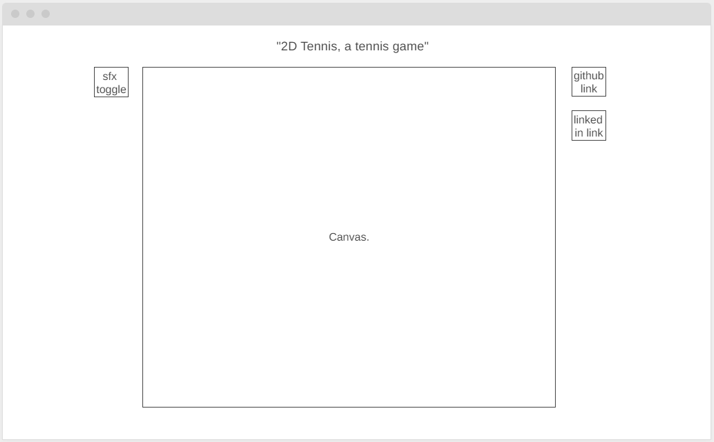

## Background

"2D Tennis, a tennis game" is a simple top-down tennis video game that follows the same scoring as tennis. [Refer to the USTA for more information on scoring rules.](https://www.usta.com/en/home/improve/tips-and-instruction/national/tennis-scoring-rules.html) In "2D Tennis", players only need to win 1 set of singles to win the match. 

## Functionality & MVPs

In "2D Tennis, a tennis game", users will be able to:

- Move around the court using WASD
- Swing at the ball using F
- Aim the swing left, center, or right by holding W, holding no direction, or holding D during the swing.

In addition, this project will include:

- A sound effects toggle button
- Post-game stats showing player's 'winners' and 'unforced errors'.
- A README

## Wireframes

- Once loaded, canvas will display the start menu that includes controls
- Sfx toggle allows user to toggle sound effects
- Buttons that are Links the the project github repo and my linkedin are to the right.

## Technologies, Libraries, APIs

- The Canvas API is used for drawing the tennis court, the net, the ball, and the players
- POSSIBILITY The Gamepad API is used to handle user input

## Implementation Timeline

- Friday Afternoon:  
    - Project setup:
    - Create MovingObject (excluding height)
    - Create Ball
    - Create HumanPlayer (any collision with the ball will count as a swing for now)
    - Make sure the velocities of the Ball and HumanPlayer are 'playable'
- Weekend
    - Create ComputerPlayer that will determine the shortest path to intercept with the moving Ball's path and move accordingly
    - Implement height to Ball and Player
    - Create Court that detects collision with Ball if Ball height is 0. Based on location in court where Ball height is 0, Court will determine if Ball is in or out
    - Create Net that detects collision with Ball if Ball height is less than Net height when crossing over the Net's position
- Monday

    - Continue working on the Ball's height and collision detection
- Tuesday
    - Add swing function to HumanPlayer.
    - Allow ComputerPlayer to use SwingFunction if in position
    - Create Game that handles score keeping
- Wednesday

    - Update Player from being a rectangle to a drawing with animations for moving and swinging
    - Add start menu, instructions, sound toggle to Game
- Thursday Morning
    - Depl0y to GitHub

## Known bugs

- At random spots, a single bounce registers as 2 bounce, causing computer to not swing at it.